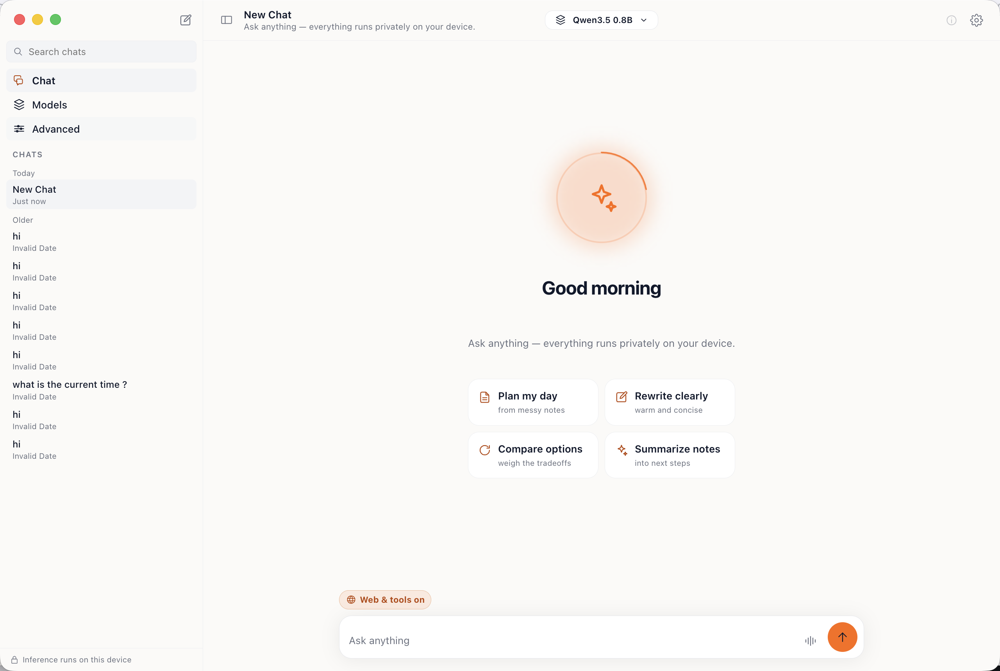
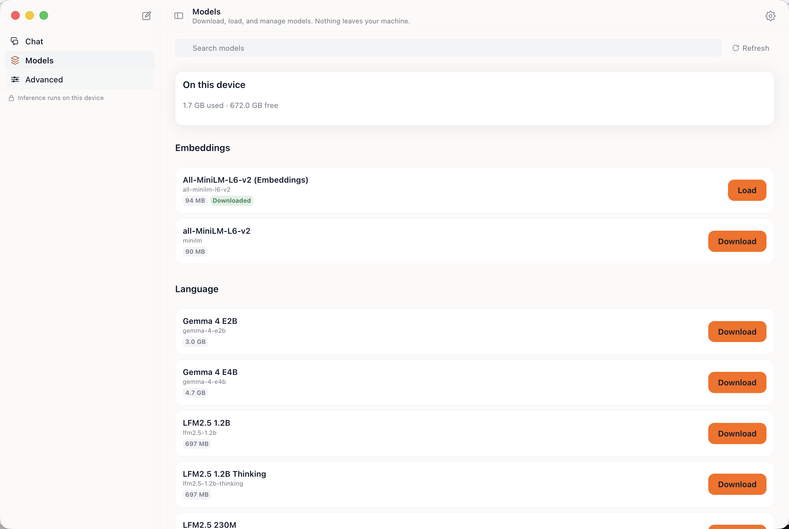

# RunAnywhere AI for Windows

<p align="center">
  
</p>

<p align="center">
  <a href="https://github.com/RunanywhereAI/runanywhere-electron/releases/latest">
    
  </a>
</p>

<p align="center">
  
  
  
  
</p>

The RunAnywhere consumer app for Windows, built with Electron.

Ask it questions, talk to it, show it an image, or point it at your own documents. Everything
runs on your machine, so nothing you type or say is sent anywhere, and it works with the
network off.

## Get it

| Your PC | Download |
| --- | --- |
| Intel or AMD | [the `win-x64` installer](https://github.com/RunanywhereAI/runanywhere-electron/releases/latest) |
| Snapdragon X and other ARM64 | [the `win-arm64` installer](https://github.com/RunanywhereAI/runanywhere-electron/releases/latest) |

Pick by the chip, not by guesswork: the two builds carry different inference engines. The
x64 build runs llama.cpp, ONNX, and Sherpa on the CPU. The ARM64 build runs QHexRT on the
Qualcomm Hexagon NPU, and nothing else, because QAIRT ships no Hexagon stub for x86_64 and
neither ggml nor ONNX Runtime builds for Windows on ARM64.

The installers are not code signed yet, so Windows SmartScreen warns the first time you run
one. Choose More info, then Run anyway.

<!-- GIF slot: chat with tool calling, the voice session, and vision.
     Waiting on the capture pass that follows the current app bug fixes. -->

## What it looks like

Captured with Qwen3.5 0.8B loaded through the llama.cpp backend.

| | |
|---|---|
|  |  |
| A new chat. The header names the loaded model, and the footer states that inference runs locally. | Models lists what is on disk and what can be pulled, grouped by embeddings and language, with sizes. |

The image files are in [`docs/screenshots/`](docs/screenshots).

## What you can do

| | |
| --- | --- |
| **Chat** | Streaming conversation with reasoning, tool calling, and structured output |
| **Voice** | Talk to it and hear the answer back |
| **Vision** | Ask about an image |
| **Knowledge** | Retrieval over documents you add yourself |
| **Transcribe** | Speech to text, batch or streaming |
| **Speak** | Read any text aloud |
| **Benchmarks** | Measure what your own machine does |
| **Models** | Download, inspect, and remove models; see disk usage |

Conversations and settings stay on disk under `%APPDATA%\RunAnywhere AI\`.

## macOS

The app builds and runs on Apple Silicon Macs (llama.cpp, ONNX, and Sherpa all load), but
the Mac app we ship to people is the native Swift one in
[runanywhere-ios](https://github.com/RunanywhereAI/runanywhere-ios). Use that unless you are
working on this codebase.

## Build it yourself

```bash
git clone https://github.com/RunanywhereAI/runanywhere-electron.git
cd runanywhere-electron

npm ci             # pulls the SDK and its native prebuilds, exactly as locked
npm start          # build, then launch
npm run dev        # watch mode: vite dev server plus electron
```

Every SDK package ships its own prebuilt native binaries, so nothing compiles from source and
`npm ci` is the whole staging step. Node 22.12 or newer; CI runs 24.

To package:

```bash
npm run package:win    # NSIS installers, x64 and arm64
npm run package:mac    # dmg and zip, arm64
```

[`docs/DEVELOPMENT.md`](docs/DEVELOPMENT.md) covers the engine matrix per platform, the
asar unpacking rules that make native loading work, the test suites, and how to point the
natives at a local SDK build.

## Architecture

Six npm packages, no monorepo checkout. The renderer never touches a native binary directly:
it talks to `window.runanywhere`, which the preload exposes across the context bridge, and
the main process forks a utility host that owns the addon.

```
   renderer (Vite, TypeScript)
        │  window.runanywhere, across the context bridge
   preload
        │
   main process ──forks──► utility host ──► @runanywhere/electron
        │                                     core addon + C++ commons
   window, local JSON store                        │
                                    ┌──────────────┼──────────────┐
                                    │              │              │
                              electron-        electron-      electron-
                              llamacpp          onnx           qhexrt
                              LLM · VLM      embeddings     Hexagon NPU
                                    │         segmentation   (win-arm64)
                              electron-sherpa
                              STT · TTS · VAD
```

All backend packages are declared unconditionally, which stays safe: a package with no
payload for the running platform records a path that does not exist, and the SDK drops
non-existent paths before forking the host. Only what your platform can actually run shows
up in `capabilities().backends`.

| Reference | |
| --- | --- |
| Engine matrix, packaging, tests, local SDK builds | [`docs/DEVELOPMENT.md`](docs/DEVELOPMENT.md) |
| Contributor conventions | [`AGENTS.md`](AGENTS.md) |

## The other apps

| Platform | Repo |
| --- | --- |
| iOS and macOS, Swift | [runanywhere-ios](https://github.com/RunanywhereAI/runanywhere-ios) |
| Android, Kotlin | [runanywhere-android](https://github.com/RunanywhereAI/runanywhere-android) |
| Web, TypeScript | [runanywhere-web](https://github.com/RunanywhereAI/runanywhere-web) |
| SDK monorepo | [runanywhere-sdks](https://github.com/RunanywhereAI/runanywhere-sdks) |
| Documentation | [docs.runanywhere.ai](https://docs.runanywhere.ai) |
| Discord | [discord.gg/N359FBbDVd](https://discord.gg/N359FBbDVd) |

## License

RunAnywhere License, Apache 2.0 based with additional commercial-use terms. See
[LICENSE](LICENSE).
